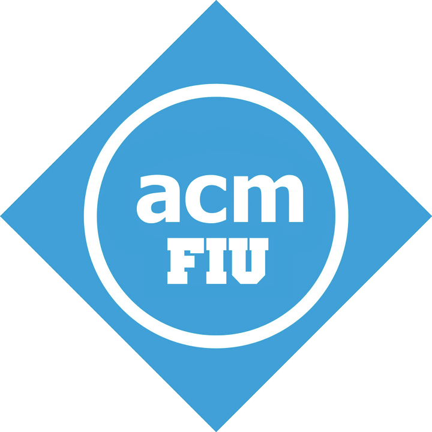

# fiuacm-website-cljs

The FIU ACM's website implemented in Cljs!!!

  

## Overview

They wanted React/Node but I gave them Reagent/Cljs!

This website can be the hub for the following club needs:

* Events dates and times
* Event video recordings and complementary workshop notes
* Social Media References
* ... and many more!

## License
MIT

## Setup

To get an interactive development environment run:

    lein figwheel

and open your browser at [localhost:3449](http://localhost:3449/).
This will auto compile and send all changes to the browser without the
need to reload. After the compilation process is complete, you will
get a Browser Connected REPL. An easy way to try it is:

    (js/alert "Am I connected?")

and you should see an alert in the browser window.

To clean all compiled files:

    lein clean

To create a production build run:

    lein do clean, cljsbuild once min

And open your browser in `resources/public/index.html`. You will not
get live reloading, nor a REPL. 

## License

MIT
